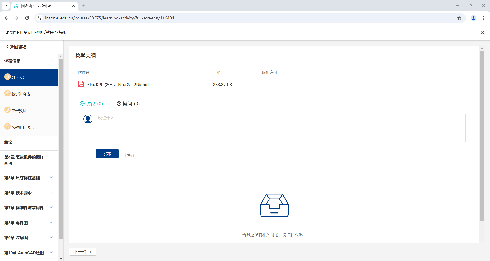

# XMUCourseFile
~~懒得~~太复杂了研究XMU的登录及一系列教务系统的api，内部整的很复杂，反正能用就行，于是就想了一个~~效率很低的~~办法，就是selenium4直接模拟然后把所有的内容打开一下，然后捕捉特定特征的东西然后下载就好了

中间的延时是我调了很多次的，执行效率低就低吧，能抓全就好

## 先登录

会提示你要登录，登录完之后回到终端按下任意键

## 然后进入课程界面

比如这样的界面

然后按下任意键继续，就会开始下载了
