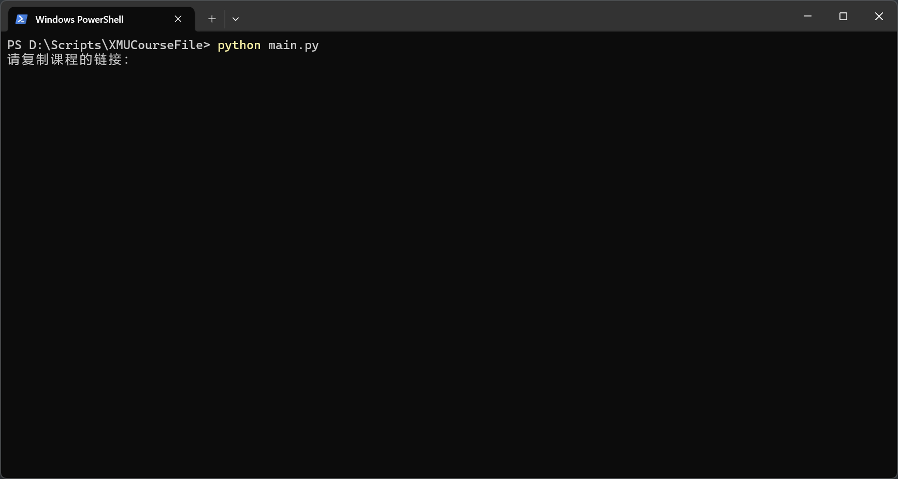
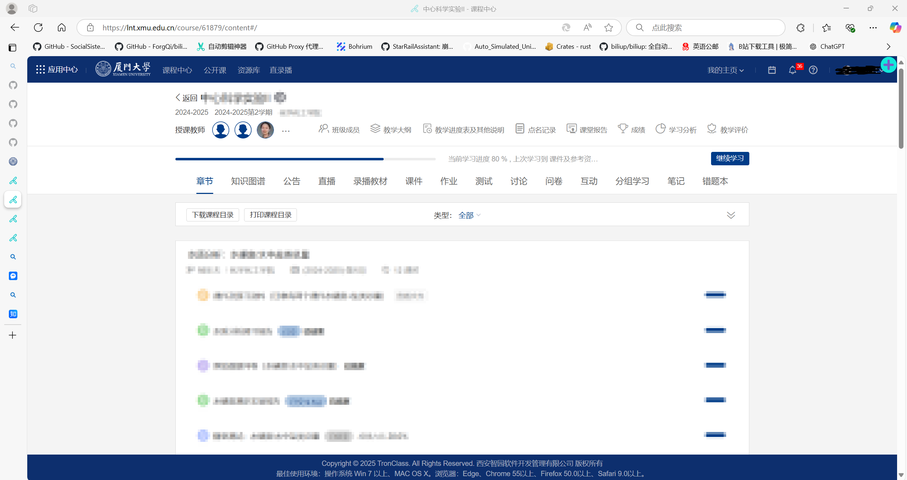
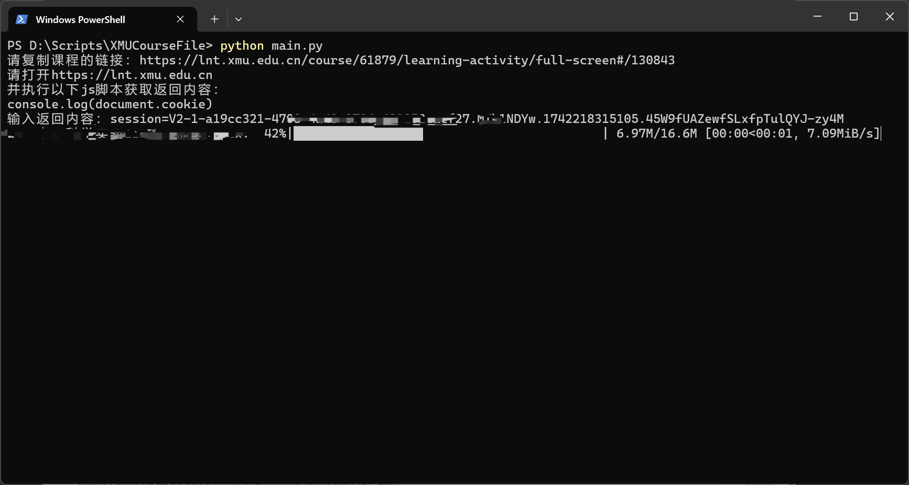

# XMUCourseFile
终于研究了一下教务系统里面的API，最终做成了这一版的东西，现在用起来可以极为方便了，基本就是开箱即用

## 使用教程

不关心代码可以直接去Release里面下载最新版的东西

这个下载需要验证你的身份信息，如果介意请勿使用

第一个是课程的链接，可以打开其中之一界面，在脚本中只是检验了链接必须以：https://lnt.xmu.edu.cn/course开头即可

以下的两个照片显示了两种可以使用的链接：

复制链接并输入后就会进入下一步

可以就在课程停留的界面先按下F12，然后进入控制台或者Console，输入js并按下回车即可

然后就会输出一行把这一行复制并输入即可

然后下载就自动开始了，在download文件夹下即可看到所有下载内容了
